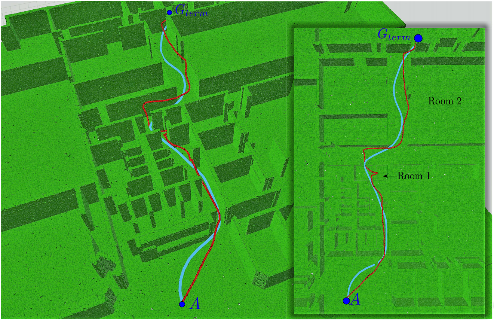
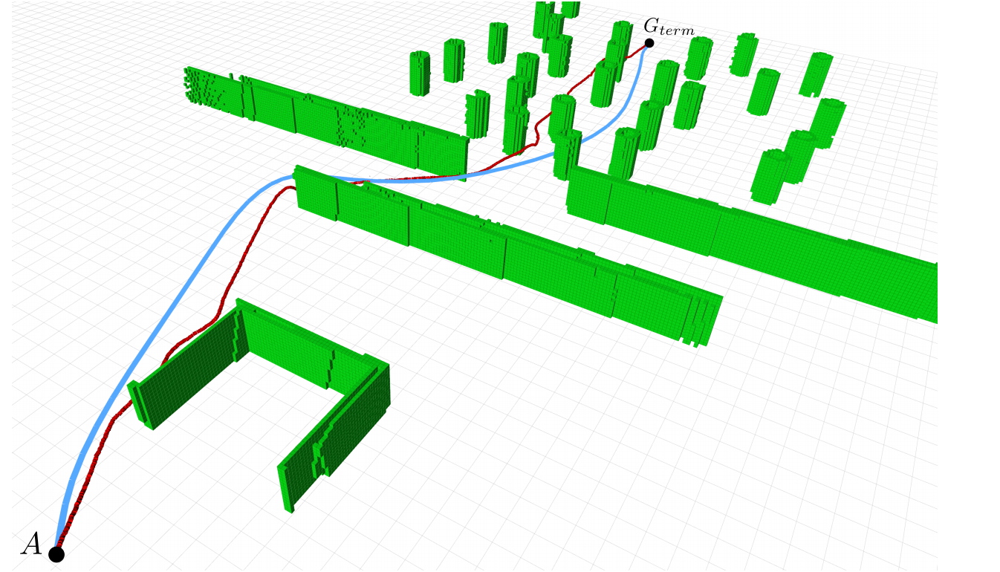
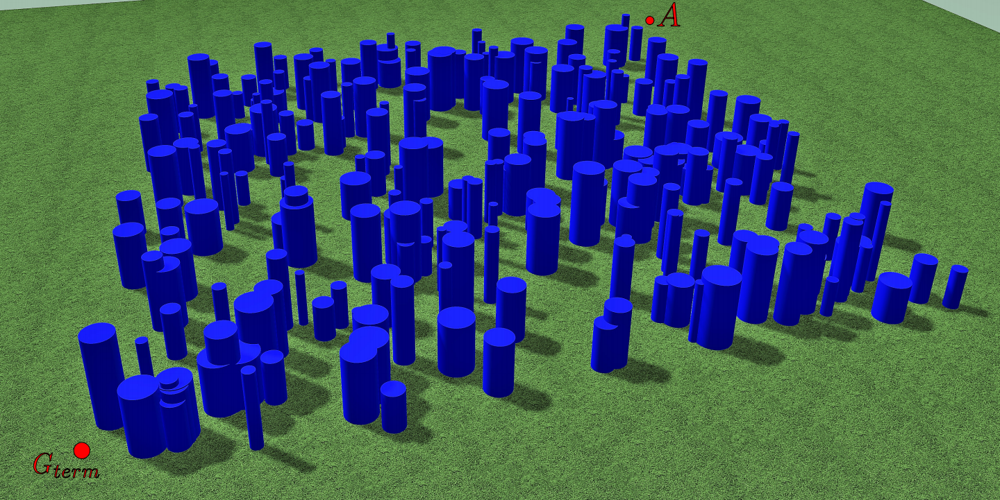

# Worlds for Gazebo #

The three worlds available in this repo are these ones:

Office (.world + .bag)     |  Bugtrap (.world + .bag)  |  Forest (x10) (.world + .cpp)
:-------------------------:|:-------------------------:|:-------------------------:
     |    |   


## Citation
When using this code, please cite these papers: 

**FASTER: Fast and Safe Trajectory Planner for Flights in Unknown Environments** (IROS 2019) ([pdf](https://arxiv.org/abs/1903.03558), [video](https://www.youtube.com/watch?v=gwV0YRs5IWs))

```bibtex
@inproceedings{tordesillas2019faster,
  title={{FASTER}: Fast and Safe Trajectory Planner for Flights in Unknown Environments},
  author={Tordesillas, Jesus and Lopez, Brett T and How, Jonathan P},
  booktitle={2019 IEEE/RSJ International Conference on Intelligent Robots and Systems (IROS)},
  year={2019},
  organization={IEEE}
}

```

**Real-Time Planning with Multi-Fidelity Models for Agile Flights in Unknown Environments** (ICRA 2019) ([pdf](https://arxiv.org/abs/1810.01035), [video](https://www.youtube.com/watch?v=E4V2_B8x-UI))

```bibtex
@inproceedings{tordesillas2019real,
  title={Real-Time Planning with Multi-Fidelity Models for Agile Flights in Unknown Environments},
  author={Tordesillas, Jesus and Lopez, Brett T and Carter, John and Ware, John and How, Jonathan P},
  booktitle={2019 IEEE International Conference on Robotics and Automation (ICRA)},
  year={2019},
  organization={IEEE}
}
```


## Instructions:
Create a workspace (if you do not have one yet), clone this repository and compile it:
```
mkdir ws && cd ws && mkdir src && cd src
git clone https://github.com/jtorde/planning_worlds_gazebo.git
cd ..
catkin build
source devel/setup.bash 
```
#### To launch a world in Gazebo:
```
roslaunch planning_worlds_gazebo start_world.launch
```
(the world name is specified can be modified in the launch file or in the command line)

#### To generate your own random forest:
In one terminal:
```
roslaunch gazebo_ros empty_world.launch
```
And in other one:
```
rosrun planning_worlds_gazebo create_random_forest
```

The cylinders will start to polulate the world with the density specified in `create_random_forest.cpp`.


## License and Credits
BSD 3-Clause, see License file attached

Some parts of the code of `create_random_forest.cpp` has been take from [here](https://github.com/ethz-asl/mav_voxblox_planning/blob/master/mav_planning_benchmark/src/local_planning_benchmark.cpp).

The file `gazebo_cube_spawner.h` is from [here](https://github.com/JenniferBuehler/gazebo-pkgs/blob/master/gazebo_test_tools/include/gazebo_test_tools/gazebo_cube_spawner.h)

The office world is the `willow_garage.world` provided by Gazebo
